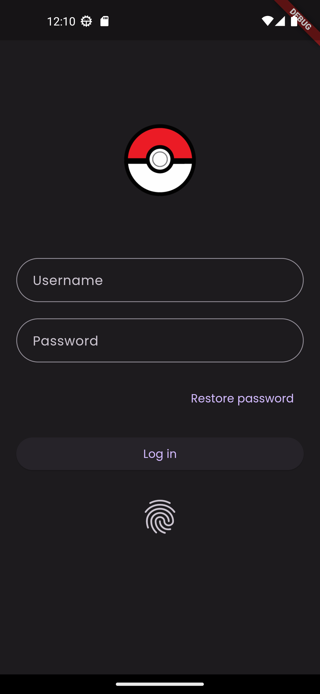

# evolvers

A new Flutter project.

## Using on this app

- Clean Architecture
- BLoC
- go_route
- GetIt
- freezed
- either
- http
- [PokeApi](https://pokeapi.co/)

## Clean Architecture Diagram


## Screenshots

<br>
<p align="center">



</p>

## How to use

To clone and run this application, you'll need [Git](https://git-scm.com/downloads) and [Flutter](https://flutter.dev/docs/get-started/install) installed on your computer. From your command line:

```
# Clone this repository
$ git clone https://github.com/urabadigital/flutter_pokeapi.git

# Go into the repository
$ cd flutter_pokeapi

# Install dependencies
$ flutter pub get

# generate codes
$ dart run build_runner build --delete-conflicting-outputs

# Run the app
$ flutter run
```
